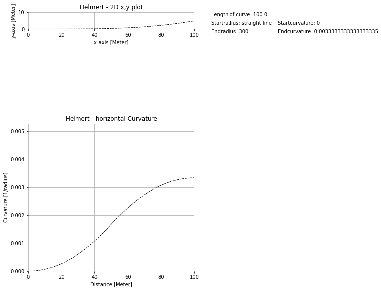

# Testdata for singular alignment segment
# Attention! Verification pending, data is preliminary!
# Numeric Integration is used for x,y coordinates, no approximation with BiquadraticParabola.
x,y coordinates are calculated along the segment starting in 0,0 into the direction of positive x-axis in stated stepsize.
Parametervalues (e.g. curvature, gradient, cant/cantangle) are calculated along the segment in stated stepsize.
## Segment parameters
* Segmenttype: Helmert (nonlinear change of curvature)
* Total length of segment: 100.0
* Length Unit: Meter
* Startradius: straight line
* Endradius: 300 (left leaning)
* Startcurvature ( 1 / Startradius): 0
* Endcurvature ( 1 / Endradius): 0.0033333333333333335
* Increments (stepsize in Meter): 1
## Standardplots

