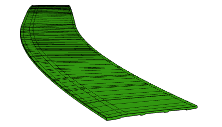
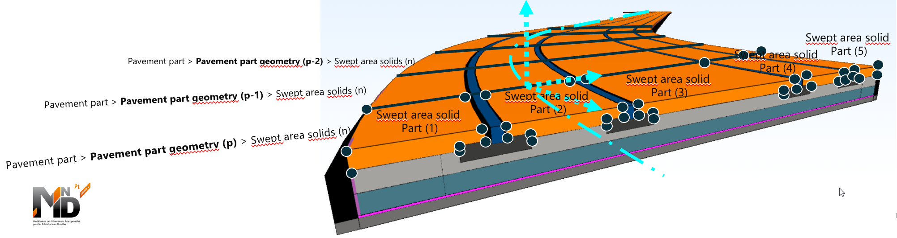

# Unit Test: trackbed

|       Unit Test title     | ID | Author | Data Owner | Format | Software Vendors |
|:-------------------------:|:--:|:------:| :---------:| :-----:| :---------------:|
| Trackbed | UT_SAS_4 | Sylvain MARIE | MINnD4Rail | IFC4.2 | RDF |

## General
This Unit Test intends to demonstrate how variable profiles along an axis can provide a Swept Area Solid to represent a trackbed.

## Prerequisites
This Unit Test builds upon the IFC 4.2 [sectioned solid sample file](http://standards.buildingsmart.org/IFC/DEV/IFC4_2/FINAL/HTML/link/sectioned-solid.htm).
## Data Description

Don't be fooled, the example file looks strangely like a bridge BUT it's meant to represent a trackbed.

Current IFC 4x3RC3 reference file (filtered) used to demonstrate swept volumes:

Intended usage for Swept Area Solid unit test: an urban railway trackbed:

The file leverages the same entities required to model a trackbed made of variable profiles (and, well, we didn't have a full fledged CAD environment at hand to generate a trackbed geometry). Anyway, the example contains the same IFC entities required to represent a trackbed, namely [IfcSectionedSolidHorizontal](http://standards.buildingsmart.org/IFC/DEV/IFC4_3/RC2/HTML/link/ifcsectionedsolidhorizontal.htm).
